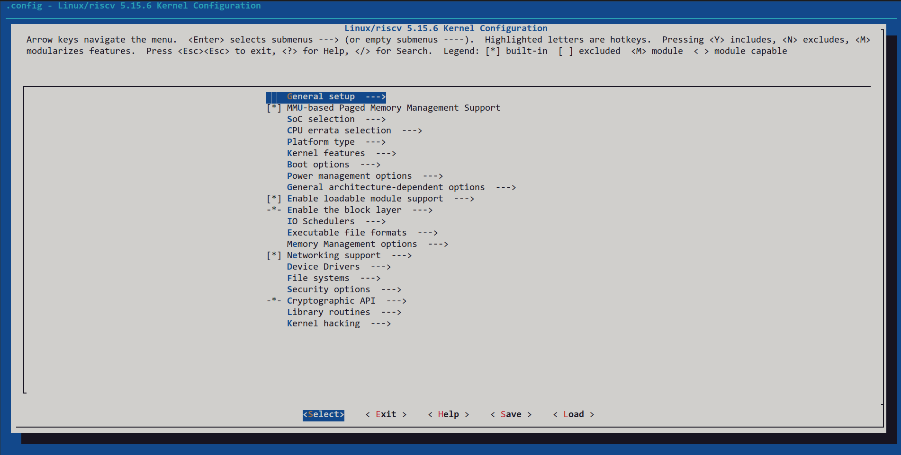

# 实验1 PolyOS AIoT安装和内核编译与安装

<center>郝淼 202328013229045</center>

## 任务一：构建、运行 PolyOS

构建 PolyOS：

```shell
git clone https://gitee.com/riscv-raios/build_portal.git && cd build_portal
PATH=${PATH}:~/.local/bin kas build common-oscourse-qemuriscv64.yml
```

构建结束后，命令行输出如图：


在 QEMU 上运行 PolyOS：

```shell
kas shell common-qemuriscv64-core-image-minimal.yml -c 'runqemu nographic'
```

BIOS 启动：


用户登录：


常用命令：


输入 `poweroff` 关机。

## 任务二：内核编译与安装

打开 Kconfig 的命令行图形配置界面：

```shell
kas shell common-oscourse-qemuriscv64.yml -c 'bitbake linux-yocto -c menuconfig'
```

效果如图：



配置完成后，通过 `Exit` 选项退出 menuconfig，然后编译并安装内核：

```shell
kas shell common-oscourse-qemuriscv64.yml -c 'bitbake linux-yocto'
```

编译安装内核结束后，输出如下：


## 任务三：内核模块编程

在 `build_portal/meta-oscourse/recipes-modules` 下新建以学号命名的目录项：

```shell
.
├── 202328013229045
├── hello
├── kmalloc
├── request_mem_region
├── request_region
└── vmalloc
```

在 `202328013229045` 下创建若干文件：

```shell
202328013229045/
├── 202328013229045.bb
└── files
    ├── 202328013229045.c
    └── Makefile
```

各文件内容：

```shell
$ cat 202328013229045.bb
LICENSE = "CLOSED"

SRC_URI = "file://202328013229045.c \
           file://Makefile \
         "

inherit module 

S = "${WORKDIR}"

# The inherit of module.bbclass will automatically name module packages with
# "kernel-module-" prefix as required by the oe-core build environment.

RPROVIDES:${PN} += "kernel-module-202328013229045"

$ cat files/202328013229045.c
#include <linux/module.h> 
 
static int __init my_module_init(void)
{
        printk(KERN_ALERT"hello world!\n");
        return 0;
}
 
static void __exit my_module_exit(void)
{
}
 
module_init(my_module_init);
module_exit(my_module_exit);
MODULE_LICENSE("GPL");
MODULE_AUTHOR("Miao Hao");

$ cat files/Makefile
obj-m += 202328013229045.o

SRC := $(shell pwd)

all:
        $(MAKE) -C $(KERNEL_SRC) M=$(SRC)

modules_install:
        $(MAKE) -C $(KERNEL_SRC) M=$(SRC) modules_install

clean:
        $(MAKE) -C $(KERNEL_SRC) M=$(SRC) clean

```

修改 `build_portal/meta-oscourse/conf/layer.conf`：

```shell
14,15c14,15
< MACHINE_ESSENTIAL_EXTRA_RRECOMMENDS += "hello kmalloc-mod vmalloc-mod request-region request-mem-region "    
< KERNEL_MODULE_AUTOLOAD += "hello kmalloc-mod vmalloc-mod request-region request-mem-region "
---
> MACHINE_ESSENTIAL_EXTRA_RRECOMMENDS += "hello kmalloc-mod vmalloc-mod request-region request-mem-region 202328013229045 "    
> KERNEL_MODULE_AUTOLOAD += "hello kmalloc-mod vmalloc-mod request-region request-mem-region 202328013229045 "
```

编译自定义模块：

```shell
kas shell common-oscourse-qemuriscv64.yml -c 'bitbake 202328013229045'
```

重新构建 PolyOS，并在 QEMU 中运行：

```shell
kas build common-oscourse-qemuriscv64.yml
kas shell common-qemuriscv64-core-image-minimal.yml -c 'runqemu nographic'
```

登录后，内核已自动加载自定义模块，并可通过 `dmesg` 查看加载输出：


卸载自定义模块，然后重新加载，并查看输出：


