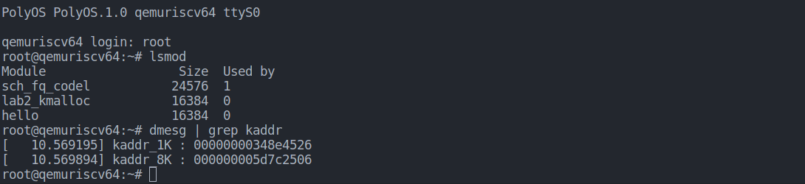

# 实验2

郝淼 202328013229045

## 任务一：kmalloc

加载 kmalloc 模块，内核输出如下：

## 任务二：vmalloc

加载 vmalloc 模块，内核输出如下：

此时为 64 位 RISC-V 虚拟机，显然不是按照 3GB ~ 3GB+896MB 进行地址划分的

## 任务三：io-port

加载、卸载 io-port 模块，然后分别查看 /etc/ioport 中的内容：

发现加载后多了起始地址为 0xfc，长度为 4，名称为 lab2 的 io 端口

## 任务四：io-mem

加载、卸载 io-mem 模块，然后分别查看 /etc/mem 中的内容：

发现加载后多了起始地址为 0xfc，长度为 4，名称为 lab2 的 io 内存，但卸载模块时发生错误，可能是由于 0xfc 开始的这段地址非法造成的