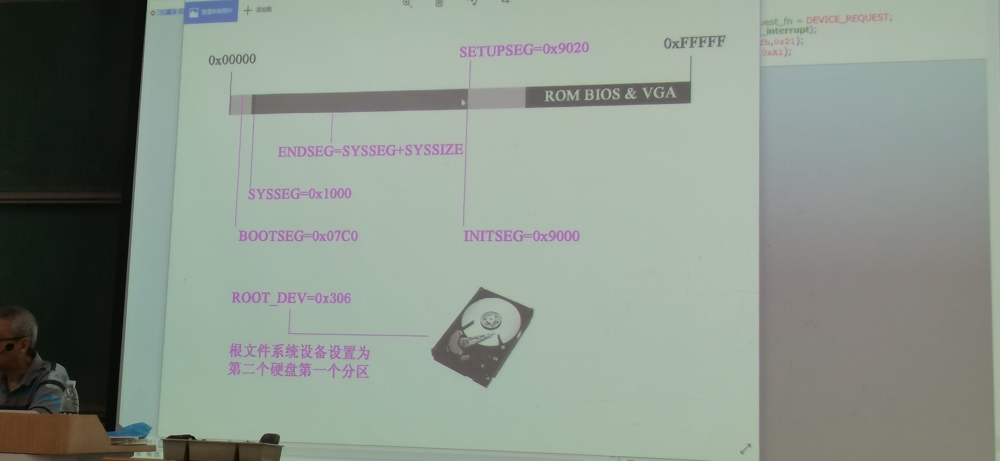
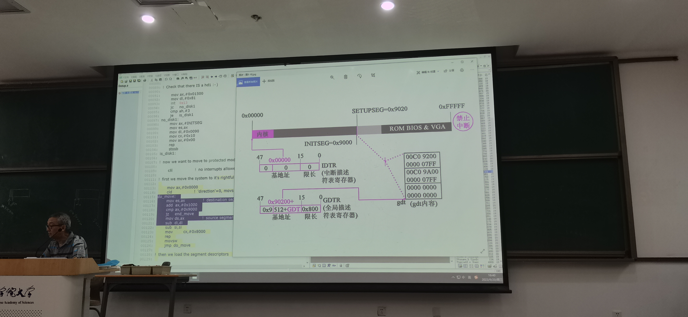

## bootsect.s

- 将自身拷贝到 INITSEG

```
BOOTSEG=0x07c0
SYSSEG=0x1000

INITSEG=0x9000
SETUPSEG=0x9020（521B 的大小）

ROOT_DEV=0x306(根文件系统为第二块硬盘的第一个分区)
```



- 设置段寄存器、栈

- `int 0x13` 拷贝 2 - 5 扇区（setup.s）拷贝到 `SETUPSEG`

- `int 0x13` 将硬盘中 6 - 约 240 扇区（head.s + C 语言代码）的 kernel 拷贝到 `SYSSEG`

- 跳转到 `SETUPSET`

## setup.s

主要解决**保护模式的问题**

- 在 `INITSEG ~ SETUPSEG` 之间存一些机器系统数据

|内存地址|长度|名称|
|:---:|:---:|:---:|
|0x90002|2|扩展内存数|
|...|...|...|

- `cli` 关中断（`EFLAGS.IF = 0`）

准备进入保护模式，替换原有 BIOS 的中断向量表为 IDT，因此需要关闭中断

- 把内核移动到 `0x00000`，`head.s` 在最前面

GDT 全局描述符表：描述段信息



- 设置 `idtr` 和 `gdtr`

- 打开 A20 地址线，内存寻址空间变为 32 位

- 编程中断控制器 8259A

- `CR0.PE = 1` 进入**保护模式**，CS，ES 等成为段选择子

- `jmpi 0, 8` 偏移 0，CS = 8，按照段选择子翻译，选择了 GDT 中的第一项，结果是跳转到了 `0x0` 处（head.s）

