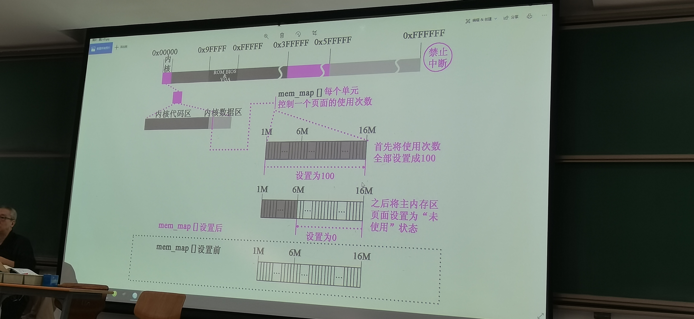
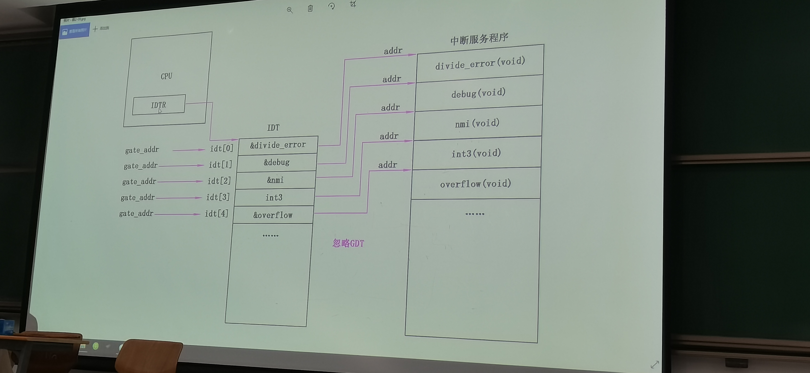
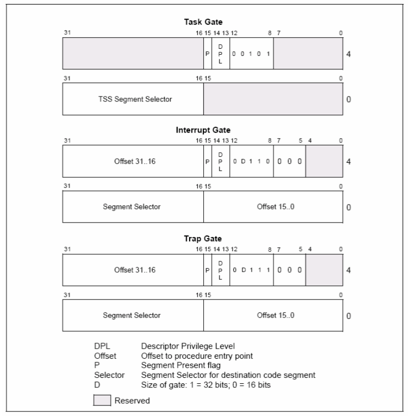

## main.c

1. 内存布局，根据物理内存的大小决定（块设备文件）缓冲区大小

`EXT_MEM_K` 处为从 1 MB 开始的扩展内存数（KB数）

2. `RAMDISK` 在 RAM 上虚拟的软盘，`rd_init()` 进行初始化

填充 dev mem 块设备结构体，`MJOR_NR = 1`

```c
// kernel/blk_drv/blk.h
/* 
 * blk_dev_struct 中存放了 2 个指针
 * request_fn 是 request 的服务程序（函数）
 * struct request 与缓冲区有关
 */
struct blk_dev_struct {
	void (*request_fn)(void);
	struct request * current_request;
};

// kernel/blk_drv/ll_rw_blk.c
/* blk_dev_struct is:
 *	do_request-address
 *	next-request
 */
struct blk_dev_struct blk_dev[NR_BLK_DEV] = {
	{ NULL, NULL },		/* no_dev */
	{ NULL, NULL },		/* dev mem */
	{ NULL, NULL },		/* dev fd */
	{ NULL, NULL },		/* dev hd */
	{ NULL, NULL },		/* dev ttyx */
	{ NULL, NULL },		/* dev tty */
	{ NULL, NULL }		/* dev lp */
};

// kernel/blk_drv/ramdisk.c
	blk_dev[1].request_fn = do_rd_request;
```

3. `mem_init`，初始化 `mem_map[]`，记录（物理）内存使用情况（引用计数），一个数组项管一个页

`USED = 100` 表示内核使用的物理内存，由于 kernel 仅支持 64 个进程，因此任何其他内存页的引用计数不可能达到 100



4. `trap_init` 填 `idt`（head.s 中）





填充 idt 的核心宏函数：

```c
#define _set_gate(gate_addr,type,dpl,addr) \
__asm__ ("movw %%dx,%%ax\n\t" \
	"movw %0,%%dx\n\t" \
	"movl %%eax,%1\n\t" \
	"movl %%edx,%2" \
	: \
	: "i" ((short) (0x8000+(dpl<<13)+(type<<8))), \
	"o" (*((char *) (gate_addr))), \
	"o" (*(4+(char *) (gate_addr))), \
	"d" ((char *) (addr)),"a" (0x00080000))

#define set_intr_gate(n,addr) \
	_set_gate(&idt[n],14,0,addr)

#define set_trap_gate(n,addr) \
	_set_gate(&idt[n],15,0,addr)

#define set_system_gate(n,addr) \
	_set_gate(&idt[n],15,3,addr)
```

其中 eax 中的内容是 id 的低 4 字节，edx 中为 id 的高 4 字节

- `i`：immediate
- `o`：offset
- `d`：edx
- `a`：eax
