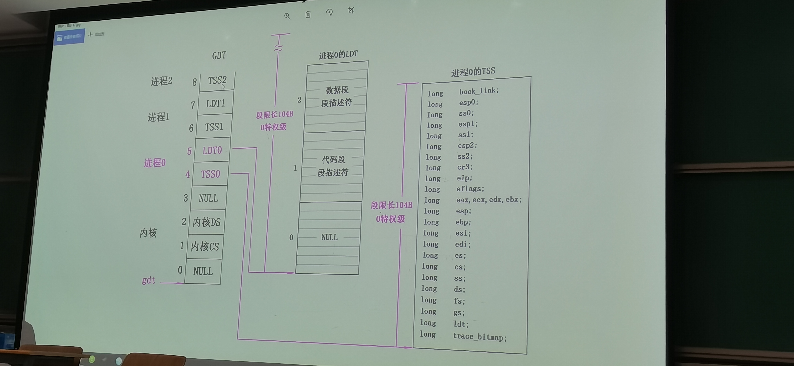

5. `blk_dev_init`：初始化 `request[]`（为什么是 32 项？），`dev` 域置为 -1，链表指针置空

6. `chr_dev_init`：终端（stdout）和标准键盘（stdin）

7. `tty_init`：tty（电传打字机）`rs_init` 和 `con_init` 初始化串口和显示器？

8. `time_init`

9. `sched_init`：进程相关的初始化

- 设置 gdt 中的 tss（第 5 项）和 ldt（第 6 项）描述符，后面清空，跟用户进程有关

tss：task state segment

- `ltr`，`lldt`

- 设置系统调用的系统门 `set_system_gate(0x80,&system_call);`

