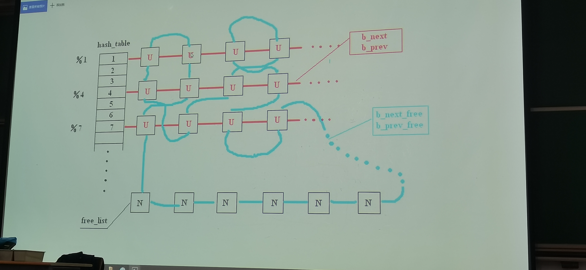

## 1 号进程（init）

1. `setup()` 进行块设备初始化，系统调用 `sys_setup`

- `bread()` 读磁盘块到缓冲区，初始化文件系统，它的返回值是内存缓冲区的地址。

```c
/*
 * bread() reads a specified block and returns the buffer that contains
 * it. It returns NULL if the block was unreadable.
 */
struct buffer_head * bread(int dev,int block)
```

如何设计缓冲区？

```c
struct buffer_head {
	char * b_data;			/* pointer to data block (1024 bytes) */
	unsigned long b_blocknr;	/* block number */
	unsigned short b_dev;		/* device (0 = free) */
	unsigned char b_uptodate;
	unsigned char b_dirt;		/* 0-clean,1-dirty */
	unsigned char b_count;		/* users using this block */
	unsigned char b_lock;		/* 0 - ok, 1 -locked */
	struct task_struct * b_wait;
	struct buffer_head * b_prev;
	struct buffer_head * b_next;
	struct buffer_head * b_prev_free;
	struct buffer_head * b_next_free;
};
```



初始时，所有缓冲块头部被 `b_prev_free` 和 `b_next_free` 串成双向环链表。
运行时，这些头部不断被插入到一个哈希表的一项中，使用 `b_prev` 和 `b_next` 串成双向链表中。

> 达到能够多次利用的目标

让缓冲区里的数据待的时间尽可能长

`get_blk()` 分配缓冲区

- 先查哈希表，如果有则直接返回

```c
if ((bh = get_hash_table(dev,block)))
	return bh;
```

- 找
  - 首先 `b_count = 0`，
  - 尽量是 `b_dirty = 0`，最后是 `b_lock = 0`（这两个条件在 `BADNESS` 宏中，不强制要求）。也就是说 dirt 和 lock 里优先选 lock 的，处于 dirt 的可能还没有向硬盘写。

  > 锁是缓冲区的，硬盘写缓冲区，进程读/写缓冲区

```c
do {
	if (tmp->b_count)
		continue;
	if (!bh || BADNESS(tmp)<BADNESS(bh)) {
		bh = tmp;
		if (!BADNESS(tmp))
			break;
	}
/* and repeat until we find something good */
} while ((tmp = tmp->b_next_free) != free_list);
```
