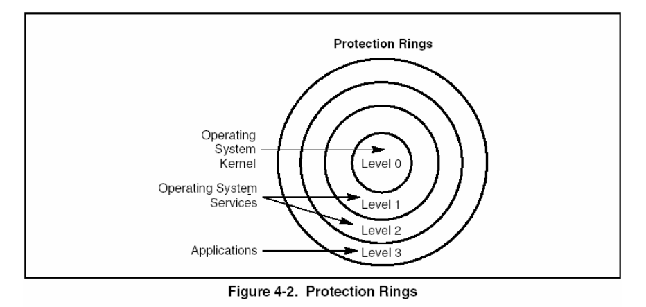

# 第 3 章 保护模式内存管理
## 逻辑地址到线性地址

进行转换时，处理器还要检查权限和地址超限

## 段选择子

出现了请求特权级 RPL

## 段描述符

GDT 或 LDT 中的一项

出现了描述符特权级 DPL

代码段的一致性：

- 进程转入一个特权级更高的**一致性段**时，可以在当前特权级继续执行下去
- 进程只能通过调用门或任务门转入一个特权级更高的**非一致性段**

数据段都是非一致性的，不能被特权级更低的进程访问，但高特权级的进程可以访问低特权级的数据段

## 系统描述符

段描述符.S = 0 时，描述符为系统描述符，包括：

- 任务状态段（LDT，TSS）
- 门描述符

## 段描述符表

包括 GDT 和 LDT

GDT 不是一个段，LDT 位于类型为 LDT 的系统段内。GDT 中包含一个指向 LDT 段的描述符（图中第 2 项），通过 LDTR 中的段选择子选择。LDTR 的段选择子被加载后，LDT 段的基址和界限就将被加载到 LDTR 中。

## 分页

4K 分页使用二级页表，包含页目录和页表

关键位：

- P（0）：存在
- R/W（1）：可读写 = 1，只读 = 0
- U/S（2）：用户特权 = 1，管理特权 = 0

# 第 4 章 保护

用于段级保护的标志：

1. 确定描述符类型
   - 描述符类型（S）标志——（段描述符的第二个双字的第 12 位）
   - 类型域——（段描述符的第二个双字的第 8 到第 11 位）

2. 确定段长度
   - G 标志——（段描述符的第二个双字的第 23 位）
   - E 标志——（数据段描述符的第二个双字的第 10 位）

3. 确定段的特权级
   - 描述符特权级（DPL）域——（段描述符的第二个双字的第 13 和第 14 位）

4. 确定段选择子的请求 特权级
   - 请求特权级（RPL）域——（段选择子的第 0 和第 1 位）

5. 指明当前执行程序 /例程的特权级
   - 当前特权级（CPL）域——（CS 段寄存器的第 0 和第 1 位）

用于页级保护

1. 确定页的类型
   - 用户/管理（U/S）标志——（页目录表项或页表项的第 2 位）

2. 确定页的访问类型
   - 读/写（R/W）标志——（页目录表项和页表项的第 1 位）

## 界限检查

如访问偏移超过段界限

## 类型检查

如向代码段写入数据、CS 装入了数据段选择子

## 特权级

CPL：在 CS 和 SS 的 [1:0] 中，当处理器访问与 CPL 特权级不同的一致性代码段时，不改变 CPL；否则改变 CPL

DPL：在描述符的 DPL 域中。访问一个段时，处理器将 DPL 与 CPL 和 RPL 进行比较
- 数据段：最大特权级数值
- 非一致性代码段：应该具有的特权级
- 调用门：最大特权级数值
- 通过调用门访问的代码段：最低特权级数值
- TSS：最高特权级数值

RPL：在段选择子的 [1:0] 中。若 RPL > CPL 则 RPL 取代 CPL。

特权级检验发生在段描述符的段选择子被装入段寄存器时。