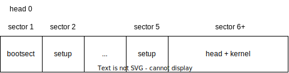

### 1. 为什么开始启动计算机的时候，执行的是BIOS代码而不是操作系统自身的代码？

因为 BIOS 固化在 ROM 中，进行修改比较困难，而操作系统代码可能需要频繁升级。

### 2. 为什么BIOS只加载了一个扇区，后续扇区却是由bootsect代码加载？为什么BIOS没有直接把所有需要加载的扇区都加载？

因为 BIOS 不知道一共有多少扇区，和程序员约定好只加载一个扇区，双方实现起来都比较容易。

### 3. 为什么BIOS把bootsect加载到0x07c00，而不是0x00000？加载后又马上挪到0x90000处，是何道理？为什么不一次加载到位？

`0x7c00` 是上世纪 IBM 在基于 8086 实现 BIOS 时约定的，这是 32KB 的最后 512B。挪到 `0x90000` 是为了操作系统后续操作，之所以不一步到位是因为在远古时期内存只有 32KB，现在虽然内存更多了，但是约定已经形成，为了与前面兼容，不易修改。

### 4. bootsect、setup、head程序之间是怎么衔接的？给出代码证据。



#### bootsect 与 setup 的衔接

1. bootsect 首先将自身拷贝到 `0x9000:0x0000`

2. 然后在 `load_setup` 循环中将第 2 至 5 扇区拷贝到 `0x9020:0x0000` 开始的内存，代码见下：

```S
load_setup:
	mov	dx,#0x0000		! drive 0, head 0
	mov	cx,#0x0002		! sector 2, track 0
	mov	bx,#0x0200		! address = 512, in INITSEG
	mov	ax,#0x0200+SETUPLEN	! service 2, nr of sectors
	int	0x13			! read it
	jnc	ok_load_setup		! ok - continue
	mov	dx,#0x0000
	mov	ax,#0x0000		! reset the diskette
	int	0x13
	j	load_setup
```

3. 在 bootsect 的最后，跳转到 `0x9020:0x0000` 执行 setup 代码

```s
! after that (everyting loaded), we jump to
! the setup-routine loaded directly after
! the bootblock:

	jmpi	0,SETUPSEG
```

#### setup 与 head 的衔接

1. 将位于 `0x1000:0x0000` 处的 head + kernel 移动到 `0x0000:0x0000` 处

```s
! first we move the system to it's rightful place

	mov	ax,#0x0000
	cld			! 'direction'=0, movs moves forward
do_move:
	mov	es,ax		! destination segment
	add	ax,#0x1000
	cmp	ax,#0x9000
	jz	end_move
	mov	ds,ax		! source segment
	sub	di,di
	sub	si,si
	mov 	cx,#0x8000
	rep
	movsw
	jmp	do_move
```

2. 设置 gdtr

```s
	lgdt	gdt_48		! load gdt with whatever appropriate


gdt_48:
	.word	0x800		! gdt limit=2048, 256 GDT entries
	.word	512+gdt,0x9	! gdt base = 0X9xxxx
```

3. 目前 gdt 中有 3 项，其中第 1 项用于代码段，第二项用于数据段

```s
gdt:
	.word	0,0,0,0		! dummy

	.word	0x07FF		! 8Mb - limit=2047 (2048*4096=8Mb)
	.word	0x0000		! base address=0
	.word	0x9A00		! code read/exec
	.word	0x00C0		! granularity=4096, 386

	.word	0x07FF		! 8Mb - limit=2047 (2048*4096=8Mb)
	.word	0x0000		! base address=0
	.word	0x9200		! data read/write
	.word	0x00C0		! granularity=4096, 386
```

4. setup 程序最后打开保护模式并跳转到 head

```s
	mov	ax,#0x0001	! protected mode (PE) bit
	lmsw	ax		! This is it!
	jmpi	0,8		! jmp offset 0 of segment 8 (cs)
```

### 5. setup程序的最后是jmpi 0,8 ，为什么这个8不能简单的当作阿拉伯数字8看待，究竟有什么内涵？

`8` 是移动到 cs 寄存器中的代码段段选择子，其含义为选择 GDT 中的第 1 项，RPL = 0。

### 6. 保护模式在“保护”什么？它的“保护”体现在哪里？特权级的目的和意义是什么？分页有“保护”作用吗？

保护的是对内存或外设的独立访问，保护体现在对内存的任何引用都要进行检验，特权级的目的是区分哪些代码可以访问重要的资源，意义是防止应用程序代码不加控制地访问操作系统的代码和数据，分页有保护作用。

### 7. 在setup程序里曾经设置过gdt，为什么在head程序中将其废弃，又重新设置了一个？为什么设置两次，而不是一次搞好？

第一次设置的 gdt 位于 `0x9xxxx` 处，未来可能被刷掉，因此此处在 `0x0xxxx` 处重新设置 gdt。

### 8. 内核的线性地址空间是如何分页的？画出从0x000000开始的7个页（包括页目录表、页表所在页）的挂接关系图，就是页目录表的前四个页目录项、第一个个页表的前7个页表项指向什么位置？给出代码证据。

### 9.  根据内核分页为线性地址恒等映射的要求，推导出四个页表的映射公式，写出页表的设置代码。

### 10. 为什么不用call，而是用ret“调用”main函数？画出调用路线图，给出代码证据。