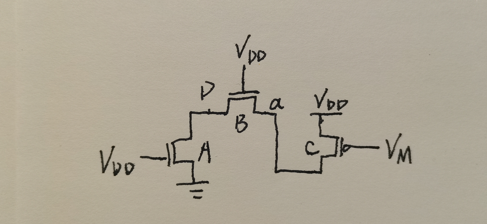

## Fundamental of VLSI 2023

郝淼 202328013229045

1. **Q：PMOS 和 NMOS 晶体管有相同的 $W$，$L$ 尺寸，并且他们的 $V_{GS}$，$V_{DS}$ 也相同，该电压使 PMOS 和 NMOS 同时处于饱和工作区，请问哪个晶体管的饱和电流更高，为什么？**

    答：NMOS 的饱和电流更高。这是因为 NMOS 中沟道载流子为电子，相比于 PMOS 的空穴而言迁移率更大，在相同电场强度下，电子的漂移速度更大。另一方面，由于 PMOS 和 NMOS 有相同的 $W$，$L$ 尺寸，它们工作在相同的饱和工作区，饱和电流与迁移率成正比，因此 NMOS 的饱和电流更高。

2. **Q：MOS 管的沟道设计长度 $L_d$ 为何与沟道实际长度 $L$（有效沟长）不同，原因何在？**

    答：因为 MOS 管的源区与漏区的扩散作用，导致有效的沟长 $L$ 比设计长度 $L_d$ 更短。

3. **Q：论述静态 CMOS 反相器的工作原理及其优点。**
    答：CMOS 反相器由一个 PMOS 和一个 NMOS 组成。当输入为高电压时，PMOS 截止，NMOS 导通，将输出下拉接地，从而形成稳态值 0V。反之，当输出为低电压时，PMOS 导通，NMOS 截止，将输出上拉接电源，从而形成稳态值 $V_{DD}$。它的优点如下：

    1. 输出的高低电平分别为 $V_{DD}$ 和 $\text{GND}$。换言之，电压摆幅等于电源电压。因此噪声容限很大。
    2. 逻辑电平与器件的相对尺寸无关，因此可以采用最小的晶体管尺寸。
    3. 稳态时在输出和 $V_{DD}$ 或 $\text{GND}$ 之间总存在一条具有有限电阻的通路。因此设计良好的 CMOS 反相器具有低输出阻抗，这使它对噪声和干扰不敏感。
    4. CMOS 反相器的输入阻抗极高，因为 MOS 管的栅是一个完全的绝缘体，因此不存在任何 dc（直流）输入电流。由于反相器的输入只连接到晶体管的栅上，因此稳态输入电流几乎为零。从而理论上单个反相器可以驱动无穷多个门而正确工作。
    5. 在稳态工作情况下电源线和地线之间没有直接的通路。没有电流存在（忽略漏电流）意味着该门并不消耗任何静态功率。

4. **Q：论述栅漏电容的密勒效应。**

    答：栅漏电容的密勒效应指的是当由低至高或由高至低的过渡中，栅漏电容两端的电压向相反的方向变化，因此在这一浮空电容上的电压变化是实际输出电压摆幅的两倍，从而可以用一个两倍于该电容值的接地电容来代替栅漏电容。

5. **Q：什么是 MOS 器件的体偏置效应，给出在体偏置条件下的 MOS 的阈值电压 $V_T$。**

    答：当在 MOS 器件的源与体之间加上一个衬底偏置电压 $V_{SB}$ 时，它使强反型所要求的表面电势增加并变为 $|-2\phi_F+V_{SB}|$。从而

    $$
    V_T=V_{T0}+\gamma (\sqrt{|(-2)\phi_F+V_{SB}|}-\sqrt{|2\phi_F|})
    $$

6. **Q：什么是扇入和扇出，说出扇入和扇出不能太大的原理。**

    答：扇入是门的输入的数目，扇出是链接到驱动门输出的负载门数目。增大扇入，将增加门的复杂性，可能增大其本身的等效电阻和本征电容，导致门的静态和动态特性变差。增大扇出，可能增大其负载电容，导致门延时上升。因此扇入和扇出不能太大。

7. **Q：说明门延时的概念。**

    答：考虑门的传播延时时，一般将其简化为一个 RC 模型，电阻为 MOS 管的等效电阻，电容为 MOS 管的本征电容加上负载电容。之所以门会产生延时，是因为通过电阻对电容进行充/放电不是在瞬间完成的，一般将电容充/放电到 $V_{DD}/2$ 的时间定义为门的延时。

8. **Q：简述门的驱动强度、尺寸、电流、电阻、电容之间的关系。**

    答：门的尺寸是在设计时确定的，影响它的驱动强度、电流等参数。一般来说，门的尺寸越大，驱动强度、电流、电容就越大，而电阻越小。

9. **Q：一数字电路符合一阶 $\text{RC}$ 网络传播延时模型（如下图），$V_{in}$ 从 $0\to V_{DD}$ 的阶跃变化，求该数字电路 $v$ 从 $0.2V_{DD}\to 0.8V_{DD}$ 的时间。**

    答：电路中的电流为 $\displaystyle{i=C\frac{\mathrm{d}v}{\mathrm{d} t}}$，根据基尔霍夫电压定律，有

    $$
    \begin{align}
    V_{DD}-Ri&=v\\
    V_{DD}-RC\frac{\mathrm{d}v}{\mathrm{d} t}&=v\\
    RC\frac{\mathrm{d}v}{\mathrm{d} t}&=V_{DD}-v\\
    \frac{\mathrm{d}v}{V_{DD}-v}&=\frac{\mathrm{d}t}{RC}
    \end{align}
    $$

    令 $u=V_{DD}-v$，$\tau=RC$，有

    $$
    -\frac{\mathrm{d}u}{u}=\frac{\mathrm{d}t}{\tau}
    $$

    两边同时积分，有

    $$
    \begin{align}
    -\int_{V_{DD}}^{V_{DD}-V_{out}}\frac{\mathrm{d}u}{u}&=\int_{0}^{t}\frac{\mathrm{d}t}{\tau}\\
    -\ln{\frac{V_{DD}-V_{out}}{V_{DD}}}&=\frac{t}{\tau}\\
    \frac{V_{DD}-V_{out}}{V_{DD}}&=e^{-\frac{t}{\tau}}\\
    V_{out}&=(1-e^{-\frac{t}{\tau}})V_{DD}
    \end{align}
    $$
    求该数字电路 $v$ 从 $0.2V_{DD}\to 0.8V_{DD}$ 的时间 $t=(\ln{\frac{10}{2}}-\ln{\frac{10}{8}})\tau=\tau\ln{4}=1.4\tau$

10. **Q：静态 CMOS 反相器的器件参数如下：
    NMOS：$V_{Tn}=0.4\text{V}$，$V_{DSATn}=0.63\text{V}$，$\mu_{n}C_{ox}=115\mu\text{A/V}^2$；PMOS：$V_{Tp}=-0.4\text{V}$，$V_{DSATp}=-1\text{V}$，$\mu_{p}C_{ox}=-30\mu\text{A/V}^2$；电源电压 $V_{DD}=2.5\text{V}$，实际沟道长度 $L_n=L_p=0.25\mu\text{m}$，**

    1. **请确定 $W_p/W_n$ 的比值，使反相器的开关阈值 $V_M=1.25\text{V}$（注：忽略沟长调制作用影响）；**

        答：在开关阈值为 $V_M$ 时，PMOS 和 NMOS 尺寸比值满足（5.5）
        $$
        \begin{align}
        \frac{(W/L)_p}{(W/L)_n}&=\frac{k_n^{\prime}V_{DSATn}(V_M-V_{Tn}-V_{DSATn}/2)}{k_p^{\prime}V_{DSATp}(V_{DD}-V_M+V_{Tp}+V_{DSATp}/2)}\\&
        =\frac{115\times 10^{-6}\times0.63\times(1.25-0.4-0.63/2)}{(-30)\times10^{-6}\times(-1)\times[2.5-1.25+(-0.4)+(-1)/2]}\\
        &=3.7
        \end{align}
        $$
        由 $L_p=L_n$，可得 $W_p/W_n=3.69$。
    2. **如果 $W_n/L_n=2$，$W_p/L_p=3$ 时（注：$\lambda_{n}=0.06\text{V}^{-1}$，$\lambda_{p}=-0.1\text{V}^{-1}$），求反相器的开关阈值 $V_M$ 和噪声容限 $NM_H$，$NM_L$；**
    
        答： 根据 （5.8）
        $$
        k_nV_{DSATn}(V_M-V_{Tn}-\frac{V_{DSATn}}{2})(1+\lambda_nV_M)+k_pV_{DSATp}(V_M-V_{DD}-V_{Tp}-\frac{V_{DSATp}}{2})(1+\lambda_{p}V_M-\lambda_{p}V_{DD})=0
        $$
        有
        $$
        2\times 115\times10^{-6}\times0.63\times(V_M-0.4-0.63/2)\times(1+0.06\times V_M)+\\
        3\times(-30)\times10^{-6}\times(-1)\times(V_M-2.5-(-0.4)-(-1)/2)\times(1+(-0.1)V_M-(-0.1)\times2.5)=0
        $$
        代入已知数据，阈值电压 $V_M=1.069\text{V}$。
        
        阈值点 NMOS 电流为
        
        $$
        \begin{align}
        I_D(V_M)&=k_nV_{DSATn}\left(V_M-V_{Tn}-\frac{V_{DSATn}}{2}\right)(1+\lambda_n V_M)\\
        &=2\times115\times10^{-6}\times0.63\times(1.069-0.4-0.63/2)\times(1+0.06\times1.069)\\
        &=54.58\times 10^{-6}\text{A}
        \end{align}
        $$
        阈值点的增益为（5.10）
        
        $$
        \begin{align}
        g&=-\frac{1}{I_D(V_M)}\frac{k_nV_{DSATn}+k_pV_{DSATp}}{\lambda _n-\lambda _p}\\
        &=-\frac{1}{54.58\times10^{-6}}\times\frac{2\times115\times10^{-6}\times0.63+3\times(-30)\times10^{-6}\times(-1)}{0.06-(-0.1)}\\
        &=-26.9
        \end{align}
        $$
        由此得如下 $V_{IL}$，$V_{IH}$，$NM_L$，$NM_H$ 的值（5.7）
        
        $$
        \begin{align}
        V_{IL}&=V_M+\frac{V_{DD}-V_M}{g}=1.069+\frac{2.5-1.069}{-26.9}=1.02\text{V}\\
        V_{IH}&=V_M-\frac{V_M}{g}=1.069-\frac{1.069}{-26.9}=1.11\text{V}\\
        NM_L&=V_{IL}=1.02\text{V}\\
        NM_H&=V_{DD}-V_{IH}=1.39\text{V}
        \end{align}
        $$
        
    3. **如果两个完全相同的反相器串联，$W_n=0.75\mu\text{m}$、$L_n=0.25\mu\text{m}$，反相器下拉时的扩散电容 $C_{dp}=1.5\text{fF}$、$C_{dn}=0.66\text{fF}$，覆盖电容 $C_{gn}=0.76\text{fF}$、$C_{gp}=2.28\text{fF}$，连线电容 $C_W=0.12\text{fF}$ 近似计算由高到低的传播延时 $t_{pHL}$**
    
        答：由（表 3.3） 可得 $2.5\mu\text{m}$ 下的 NMOS 等效电阻为 
        $$
        R_{eqn}=\frac{13\text{k}\Omega}{(W/L)_n}=\frac{13\text{k}\Omega}{0.75/0.25}=4.33\text{k}\Omega
        $$
        从而 （5.18）（5.23）
        $$
        t_{pHL}=0.96\times 4.33\times(1.5+0.66+0.76+2.28+0.12)=22.13\text{ps}
        $$
        
    
11.   **Q：$0.6\mu\text{m}$ 工艺的 NMOS 晶体管 $t_{ox}=1\times 10^{-8}\text{m}$，$\epsilon_{ox}=3.5\times 10^{-11}\text{F/m}$，电子迁移率 $\mu_{n}=350\text{cm}^2\text{/V}\cdot\text{s}$，$W/L=2$，求 NMOS 增益。**
    答：NMOS 增益为（3.26）
    $$
    \begin{align}
    k_n&=\frac{\mu_{n}\epsilon_{ox}}{t_{ox}}\times\frac{W}{L}\\
    &=\frac{350\times10^{-4}\times3.5\times10^{-11}}{1\times10^{-8}}\times2\\
    &=2.45\times 10^{-4}\text{F/V}
    \end{align}
    $$
    
12.   **Q：两个包含 NMOS 晶体管电路（如下图所示），NMOS 的尺寸及电压情况如图中所标注，其余的工艺参数相同，NMOS 均工作在电阻区，通过公式推导，验证 $I_{DS1}=I_{DS2}$（流过两个串联的等长晶体管的电流等于流过一个两倍长度的晶体管的晶体管的电流）。**
    答：假设两种 NMOS 管的增益因子分别为 $k_{n1}, k_{n2}$，由已知满足（3.26）
    $$
    2k_{n1}=k_{n2}
    $$
    对于两个串联的 NMOS，流过它们的电流相等，由于它们均工作在电阻区，有（3.25）
    $$
    I_{DS2}=k_{n2}[(V_{DD}-V_1-V_T)(V_{DS}-V_1)-\frac{(V_{DS}-V_1)^2}{2}]=k_{n2}[(V_{DD}-V_T)V_1-\frac{V_1^2}{2}]
    $$
    合并同类项，可得
    $$
    2[(V_{DD}-V_T)V_1-\frac{V_1^2}{2}]=(V_{DD}-V_T)V_{DS}-\frac{V_{DS}^2}{2}
    $$
    两边同乘 $k_{n1}$，可得
    $$
    2k_{n1}[(V_{DD}-V_T)V_1-\frac{V_1^2}{2}]=k_{n1}[(V_{DD}-V_T)V_{DS}-\frac{V_{DS}^2}{2}]
    $$
    将 $2k_{n1}=k_{n2}$ 代入，可得
    $$
    I_{DS2}=k_{n2}[(V_{DD}-V_T)V_1-\frac{V_1^2}{2}]=k_{n1}[(V_{DD}-V_T)V_{DS}-\frac{V_{DS}^2}{2}]=I_{DS1}
    $$
    命题得证。
    
13.   **Q：NMOS 晶体管的工艺参数如下：$t_{ox}=2\times 10^{-8}\text{m}$，$W=10\mu\text{m}$，$L_{d}=1.5\mu\text{m}$，$x_d=0.25\mu\text{m}$，$L_s=5\mu\text{m}$，$x_j=0.4\mu\text{m}$，源区参杂浓度 $N_D=10^{20}\text{原子/cm}^3$，衬底参杂浓度 $N_A=10^{16} \text{原子/cm}^3$，沟道阻挡层参杂浓度 $N_{A}^+=10^{19} \text{原子/cm}^3$。计算在 $300\text{K}$ 的温度下，**
    1. **分别求在 $V_D=5\text{V}$ 和 $2.5\text{V}$ 时的漏区扩散电容；**
    
        答：在 $300\text{K}$ 下底板内建电势和侧壁内建电势（3.1）
    
        $$
        \phi_{0}=\frac{kT}{q}\ln\left[\frac{N_AN_D}{n_i^2}\right]=26\times\ln{[\frac{10^{16}\times10^{20}}{(1.5\times10^{10})^2}]}=937\text{mV}\\
        \phi_{0}^+=\frac{kT}{q}\ln\left[\frac{N_A^+N_D}{n_i^2}\right]=26\times\ln{[\frac{10^{19}\times10^{20}}{(1.5\times10^{10})^2}]}=1116\text{mV}
        $$
        
        底板单位面积电容为（3.7）
        
        $$
        \begin{align}
        C_j&=\sqrt{\left(\frac{\epsilon_{si}q}{2}\frac{N_AN_D}{N_A+N_D}\right)(\phi_{0}-V_D)^{-1}}
        \end{align}
        $$
        
        同理，侧壁单位周长电容为（3.7）（3.45）
        
        $$
        C_{jsw}=x_j\sqrt{\left(\frac{\epsilon_{si}q}{2}\frac{N_A^+N_D}{N_A^++N_D}\right)(\phi_{0}^+-V_D)^{-1}}
        $$
        
        总的漏区扩散电容（结电容）为（3.45）
        
        $$
        C_{diff}=C_{bottom}+C_{sw}=C_jL_sW+C_{jsw}(2L_s+W)
        $$
        
        在 $V_D=5\text{V}$ 下，
        $$
        \begin{align}
        C_j&=\sqrt{\frac{1.053\times10^{-10}\times1.602\times10^{-19}}{2}\times\frac{10^{16}\times 10^{6}\times 10^{20}\times 10^{6}}{10^{16}\times 10^{6}+10^{20}\times 10^{6}}\times[0.937-(-5)]^{-1}}\\
        &=0.119\times 10^{-3}\text{F/m}^2\\
        C_{jsw}&=0.4\times10^{-6}\times\sqrt{\frac{1.053\times 10^{-10}\times 1.602\times 10^{-19}}{2}\times\frac{10^{19}\times 10^{6}\times 10^{20}\times 10^{6}}{10^{19}\times 10^{6}+10^{20}\times 10^{6}}\times[1.116-(-5)]^{-1}}\\
        &=1.42\times 10^{-9}\text{F/m}\\
        C_{diff}&=0.119\times10^{-3}\times5\times10^{-6}\times10\times10^{-6}+1.42\times10^{-9}\times(2\times5\times10^{-6}+10\times10^{-6})\\
        &=34.35\text{fF}
        \end{align}
        $$
        在 $V_D=2.5\text{V}$ 下，
        $$
        \begin{align}
        C_j&=\sqrt{\frac{1.053\times10^{-10}\times1.602\times10^{-19}}{2}\times\frac{10^{16}\times 10^{6}\times 10^{20}\times 10^{6}}{10^{16}\times 10^{6}+10^{20}\times 10^{6}}\times[0.937-(-2.5)]^{-1}}\\
        &=0.157\times 10^{-3}\text{F/m}^2\\
        C_{jsw}&=0.4\times10^{-6}\times\sqrt{\frac{1.053\times 10^{-10}\times 1.602\times 10^{-19}}{2}\times\frac{10^{19}\times 10^{6}\times 10^{20}\times 10^{6}}{10^{19}\times 10^{6}+10^{20}\times 10^{6}}\times[1.116-(-2.5)]^{-1}}\\
        &=1.84\times 10^{-9}\text{F/m}\\
        C_{diff}&=0.157\times10^{-3}\times5\times10^{-6}\times10\times10^{-6}+1.84\times10^{-9}\times(2\times5\times10^{-6}+10\times10^{-6})\\
        &=44.65\text{fF}
        \end{align}
        $$
    2. **求漏区的覆盖电容，$\epsilon_{ox}=3.5\times 10^{-11}\text{F/m}$。**
    
        答：覆盖电容为（3.21）（3.44）（表3.4）
        $$
        \begin{align}
        C_{GD}&=2C_{o}W\\
        &=2C_{ox}x_dW\\
        &=2\frac{\epsilon_{ox}}{t_{ox}}x_dW\\
        &=2\times\frac{3.5\times10^{-11}}{2\times10^{-8}}\times0.25\times10^{-6}\times10\times10^{-6}\\
        &=8.75\text{fF}
        \end{align}
        $$
    
14.   **有三个反相器组成的反相器链，输入电容为 $C_1=1\text{pF}$，负载电容为 $C_L=1000\text{pF}$，如果第一个反相器的尺寸为 $1$，在反相器链传播延时最小情况下，传播延时 $t_{p1}$ 为 $70\text{ps}$（注：$\gamma=1$），**
    1. **请确定其他两个反相器 $I2$、$I3$ 的尺寸，使反相器链的传播延时最小，并计算该情况下的最小延时；**

        答：对于三级反相器，达到最小延时，需要保证每一级的放大倍数相等，从而放大倍数 $f$ 为（5.35）

        $$
        \begin{align}
        f&=\sqrt[N]{F}\\
        &=\sqrt[N]{C_L/C_1}\\
        &=\sqrt[3]{1000/1}\\
        &=10
        \end{align}
        $$
        
        
        从而第二级、第三级反相器的尺寸为 
        $$
        \begin{align}
        I_2&=fI_1\\
        &=10\\
        I_3&=fI_2\\
        &=100
        \end{align}
        $$
        由（5.31）
        $$
        t_{p1}=t_{p0}(1+f/\gamma)
        $$
        可知
        $$
        t_{p0}=\frac{t_{p1}}{1+f/\gamma}
        $$
        
        
        因此，反相器链的最小延时为（5.36）
        $$
        \begin{align}
        t_p&=Nt_{p0}(1+f/\gamma)\\
        &=Nt_{p1}\\
        &=3\times70\\
        &=210\text{ps}
        \end{align}
        $$
    2. **如果允许增加更多的反相器使反相器链的延时最小，请确定插入反相器的数目，并计算该情况下的最小延时。**
    
        答：当 $\gamma = 1$ 时，最优的锥形系数约为 $f_{opt}=3.6$，从而最优的反相器级数为（图5.21）
    
        $$
        N^{\prime}=\log_{3.6}{(C_L/C_1)}\approx 5
        $$
        此时最小延时的放大倍数为（5.35）
        $$
        \begin{align}
        f^{\prime}&=\sqrt[N^{\prime}]{F}\\
        &=\sqrt[5]{1000}\\
        &=3.98
        \end{align}
        $$
        该情况下的最小延时为（5.36）
        $$
        \begin{align}
        t_p^{\prime}&=N^{\prime}t_{p0}(1+f^{\prime}/\gamma)\\
        &=N^{\prime}\frac{t_{p1}}{1+f/\gamma}(1+f^{\prime}/\gamma)\\
        &=5\times\frac{70}{1+10/1}(1+3.98/1)\\
        &=158\text{ps}
        \end{align}
        $$
    
15.   **Q：逻辑门驱动的数据总线位宽为 3bit，是由三根信号线 A、B、C 组成，两侧用地线屏蔽外部互联线串扰，总线的布线图、截面图及尺寸参数值如下图所示，其中 $W=0.4\mu\text{m}$，$S=0.6\mu\text{m}$，$H=0.4\mu\text{m}$，$T=0.6\mu\text{m}$，**
    1. **计算信号线的对地单位电容 $c_L$ 和信号线间的单位耦合电容 $c_C$，电介质介电常数$\epsilon_{r}=3.45$，（提示：电容计算公式为 $c=c_{pp}+c_{fringe}=\frac{\epsilon}{h}(w-\frac{t}{2})+\frac{2\pi\epsilon}{\log{(2h/t+1)}}$）**

        答：信号线对地单位电容为（4.2）

        $$
        \begin{align}
        c_L&=c_{pp}+c_{fringe}\\
        &=\frac{\epsilon}{H}(W-\frac{T}{2})+\frac{2\pi\epsilon}{\log{(2H/T+1)}}\\
        &=\epsilon_{0}\left[\frac{\epsilon_{r}}{H}(W-\frac{T}{2})+\frac{2\pi\epsilon_{r}}{\log{(2H/T+1)}}\right]\\
        &=8.854\times10^{-12}\times\left[\frac{3.45}{0.4\times10^{-6}}\times(0.4\times10^{-6}-\frac{0.6\times10^{-6}}{2})+\frac{2\times3.14\times3.45}{\log{(2\times\frac{0.4\times10^{-6}}{0.6\times{10^{-6}}}+1)}}\right]\\
        &=5.29\times 10^{-10}\text{F/m}
        \end{align}
        $$
        
        信号线间的单位耦合电容为
        
        $$
        \begin{align}
        c_C&=c_{pp}+c_{fringe}\\
        &=\frac{\epsilon}{S}(T-\frac{W}{2})+\frac{2\pi\epsilon}{\log{(2S/W+1)}}\\
        &=\epsilon_{0}\left[\frac{\epsilon_{r}}{S}(T-\frac{W}{2})+\frac{2\pi\epsilon_{r}}{\log{(2S/W+1)}}\right]\\
        &=8.854\times10^{-12}\times\left[\frac{3.45}{0.6\times10^{-6}}\times(0.6\times10^{-6}-\frac{0.4\times10^{-6}}{2})+\frac{2\times3.14\times3.45}{\log{(2\times\frac{0.6\times10^{-6}}{0.4\times{10^{-6}}}+1)}}\right]\\
        &=3.39\times 10^{-10}\text{F/m}
        \end{align}
        $$
    2. **受到信号线 A 和 C 的电压变化影响，信号线 B 会出现耦合电容的变化，分析产生最大耦合电容和最小耦合电容的情况，画出两种情况下的信号线 A、B 和 C 的电压变化波形图，并用密勒效应来计算两种情况下信号线 B 的单位总电容 $C_T$；**
    
        答：当 A，C 两条导线的波形与 B 沿相反方向变化时，耦合电容最大（9.2.2节），为 $c_L+4c_C$；当 A，C 两条导线的波形与 B 沿相同方向变化时，耦合电容最小，为 $c_L$。

        
    3. **总线材料为 Al，其电阻率$\rho=2.7\times 10^{-8}\Omega\cdot\text{m}$，计算信号线 B 的单位电阻；**
    
        答：信号线 B 的单位电阻为（4.3）
    
        $$
        \begin{align}
        R_L&=\frac{\rho L}{TW}\times\frac{1}{L}\\
        &=\frac{\rho}{TW}\\
        &=\frac{2.7\times10^{-8}}{0.6\times10^{-6}\times0.4\times10^{-6}}\\
        &=1.125\times 10^5\Omega\text{/m}
        \end{align}
        $$
    4. **总线长度 $L=1.0\text{mm}$，用 Elmore 模型近似计算信号线 B 的最大延迟和最小延迟。**
    
        答：最大延迟为（4.16）
    
        $$
        \begin{align}
        t_{max}&=\frac{RC_{max}}{2}\\
        &=\frac{R_LL(c_L+4c_C)L}{2}\\
        &=\frac{1.125\times10^5\times1\times10^{-3}\times(5.29\times10^{-10}+4\times3.39\times10^{-10})\times1\times10^{-3}}{2}\\
        &=106\text{fs}
        \end{align}
        $$
        
        最小延迟为
        
        $$
        \begin{align}
        t_{min}&=\frac{RC_{min}}{2}\\
        &=\frac{R_LLc_LL}{2}\\
        &=\frac{1.125\times10^5\times1\times10^{-3}\times5.29\times10^{-10}\times1\times10^{-3}}{2}\\
        &=29.8\text{fs}
        \end{align}
        $$
16.  **Q：回答下列问题：**
    1. **用互补 CMOS 门实现逻辑功能为$Out=\overline{AB+AC+BC}$的电路；**
    
        答：
    2. **用由 NMOS 构成下拉网络的多米诺门实现逻辑功能为$Out=\overline{AB+AC+BC}$的电路；**
    
        答：由德·摩根定律，有
        
        $$
        Out=\overline{AB}\cdot\overline{AC}\cdot\overline{BC}\\
        =(\overline{A}+\overline{B})(\overline{A}+\overline{C})(\overline{B}+\overline{C})
        $$
        
        
    3. **写出下面 CMOS 电路的逻辑函数功能**
    
        答：当 $P=0$ 时，上面的传输门导通，$Out=\overline{AB}$；当 $P=1$ 时，下面的传输门导通，$Out=\overline{C}$。因此下面 CMOS 电路的逻辑函数功能为
    
        $$
        Out=P\cdot\overline{C}+\overline{P}\cdot\overline{AB}
        $$
        
    
17.  **Q：一个由两个相反类型的锁存器组成的寄存器（如下图所示），驱动端 $D$ 由一个反相器所驱动，所有的交叉偶合反相器的 $W_p/W_n=2$，并且 $W_p$ 和 $W_n$ 均是 $0.25\mu\text{m}$ 工艺的晶体管最小宽度尺寸，**
    1. **指出前后串联的锁存器的正负类型及该寄存器的正负沿类型；**

        答：前面的锁存器当 $CLK=1$ 时透明，因此为正锁存器，后面的同理为负锁存器。当 $CLK=1$ 时，前面的传输管导通，将 $D$ 的值写入前面的锁存器，后面的传输管断开，$Q$ 端输出后面锁存其存储的结果；当 $CLK=1\to 0$ 时，前面锁存器的结果写入后面锁存器，并输出到 $Q$。因此每个周期 $Q$ 的值为下降沿前 $D$ 的值，从而该寄存器为负沿触发。
    2. **由于该寄存器的时钟开关采用的是传输管结构，请确定传输管的最小尺寸限制，确保能够在输入端 $D$ 为“$0$”时，能够将其写入寄存器中（忽略沟道调制且如果发生漏电流饱和则为速度饱和，晶体管的其它参数参考教材表 3.2）；**

        答：写入 $0$ 时，等效电路如下
        
        

        其中 A 是输入 D 前反相器的 NMOS，B 是传输管，C 是反馈回路中反相器的 PMOS。
        
        当 B、A 试图将 $a$ 点电压下拉时，反馈回路反相器中的 PMOS 试图将 $a$ 点电压上拉保持，从而存在竞争关系。因此，想要将“$0$”写入寄存器必须满足 A、B 的驱动强度大于 C。首先，求反相器的开关阈值电压 $V_M$，不考虑沟长调制，有（5.3）

        $$
        \begin{align}
        r&=\frac{k_pV_{DSATp}}{k_nV_{DSATn}}\\
        &=\frac{(W/L)_p\mu_{p}C_{ox}V_{DSATp}}{(W/L)_n\mu_{n}C_{ox}V_{DSATn}}\\
        &=2\times\frac{(-30)\times10^{-6}\times(-1)}{115\times10^{-6}\times0.63}\\
        &=0.828
        \end{align}
        $$

        因此（5.3）
        
        $$
        \begin{align}
        V_M&=\frac{\left(V_{Tn}+\frac{V_{DSATn}}{2}\right)+\left(V_{DD}+V_{Tp}+\frac{V_{DSATp}}{2}\right)}{1+r}\\
        &=\frac{\left(0.4+\frac{0.63}{2}\right)+0.828\times\left(2.5+(-0.4)+\frac{-1}{2}\right)}{1+0.828}\\
        &=1.12\text{V}\\
        \end{align}
        $$

        假设 $a$ 点电压为 $V_M$，且 A、B 相同，则 $V_D=V_M/2$，此时所有晶体管源漏电流相等，于是有（3.25）（5.2）

        $$
        k_pV_{DSATp}(V_{GSC}-V_{Tp}-\frac{V_{DSATp}}{2})+k_nV_{DSATn}(V_{GSB}-V_{Tn}-\frac{V_{DSATn}}{2})=0
        $$

        其中 $V_{GSC}=V_M-V_{DD}$，$V_{GSB}=V_{DD}-V_D$，从而

        $$
        \begin{align}
        \frac{(W/L)_p}{(W/L)_n}&=\frac{k_n^{\prime}V_{DSATn}(V_{DD}-V_{D}-V_{Tn}-V_{DSATn}/2)}{k_p^{\prime}V_{DSATp}(V_{DD}-V_{M}+V_{Tp}+V_{DSATp}/2)}\\
        &=\frac{115\times10^{-6}\times0.63\times(2.5-1.12/2-0.4-0.63/2)}{(-30)\times10^{-6}\times(-1)\times[2.5-1.12+(-0.4)+(-1)/2]}\\
        &=6.16
        \end{align}
        $$

        因此 $(W/L)_n/(W/L)_p>1/6.16=0.162$
    3. **如果传输管的尺寸是确定的，并且不满足成功写入“$0$”的尺寸限制条件，如何采取其它方法来保证功将“$0$”写入寄存器？**

        答：可以通过减小反馈回路反相器的 PMOS 驱动强度，即尺寸 $(W/L)_p$。
    4. **如果传输管的延时是 $t_T$，反相器的延时是 $t_{INV}$，给出寄存器建立时间 $t_{SU}$，传输延迟 $t_{cq}$ 和维持时间 $t_{hold}$。**

        答：$CLK=1$ 时，第一级传输管导通，在 $CLK=1\to 0$ 前，$D$ 要传播到 $b$ 点，然后反馈回 $a$ 点。因此 $t_{SU}=t_T+2t_{INV}$。$CLK=0$ 时，信号从 $b$ 传播到 $Q$ 的时间即为传输延迟 $t_{cq}=t_T+t_{INV}$。由于第一级传输管在 $CLK=0$ 时立即断开，因此 $D$ 的值可以立即改变，从而 $t_{hold}=0$。 
18.   **Q：下图中组合逻辑电路的反相器 $a$ 的晶体管宽度 $W_n=1\mu\text{m}$，$W_p=2\mu\text{m}$，单位晶体管宽度的栅电容 $C_g=2\text{fF/}\mu\text{m}$，$C_{out}=200\text{fF}$，（注：参考表 6.5）**
    1. **从 In 到 Out 电路的总路径努力是多少?**

        答：各级逻辑努力和分支努力分别为（表6.5）（6.11）

        |级数|门类型|逻辑努力 $g_i$|分支努力 $b_i$|
        |:---:|:---:|:---:|:---:|
        |1|反相器|$1$|$1$|
        |2|2 输入 NAND 门|$4/3$|$3/1$|
        |3|3 输入 NOR 门|$7/3$|$1$|
        |4|4 输入 NAND 门|$4/3$|$4/1$|
        |5|反相器|$1$|$1$|
        |6|2 输入 NOR 门|$5/3$|$1$|

        路径逻辑努力 $G$ 为（6.9）

        $$
        G=\Pi_{1}^{6}g_i=560/81
        $$

        路径分支努力 $B$ 为（6.12）

        $$
        B=\Pi_{1}^{6}b_i=12
        $$

        第一级反相器的输入电容 $C_{g1}$ 为

        $$
        C_{g1}=(W_p+W_n)C_g=6\text{fF}
        $$

        路径等效扇出 $F$ 为（5.35）

        $$
        F=C_{out}/C_{g1}=100/3
        $$

        总路径努力 $H$ 为（6.14）

        $$
        H=GFB=224000/81
        $$
    2. **使路径延时最小的门努力是多少？**

        答：使路径延时最小的门努力 $h$ 为（6.15）

        $$
        h=\sqrt[6]{H}=3.75
        $$

19. **Q：下图是一个 $+1$ 循环计数器电路，循环计数器逻辑块的输入为 $4$ 比特 `IN[3:0]`，输出为 $4$ 比特 `OUT[3:0]`，比特位 `[3]` 表示最高位，比特位 `[0]` 表示最低位，循环计数器的最大计数为 $9(1001)$，当输入 `IN[3:0]` 等于 $9$ 时，输出 `OUT[3:0]` 等于 $0$**
    1. **对于 `IN[3:0]` 的每一个比特位的 $0$ 和 $1$ 的概率 $p_0$ 和 $p_1$ 是多少？**

        答：`IN[3:0]` 的所有可能为

        |`IN[3:0]`|
        |:---:|
        |$0000$|
        |$0001$|
        |$0010$|
        |$0011$|
        |$0100$|
        |$0101$|
        |$0110$|
        |$0111$|
        |$1000$|
        |$1001$|

        因此每位的 $0$ 和 $1$ 的概率 $p_0$ 和 $p_1$ 是
        
        |`IN[3:0]`|$p_0$|$p_1$|
        |:---:|:---:|:---:|
        |`IN[0]`|$0.5$|$0.5$|
        |`IN[1]`|$0.6$|$0.4$|
        |`IN[2]`|$0.6$|$0.4$|
        |`IN[3]`|$0.8$|$0.2$|

    2. **对于 `IN[3:0]` 的每一个比特位从 $0\to 1$ 的翻转因子各是多少？**

        答：`IN[0]` 从 $0\to 1$ 翻转的可能情况有：$0000\to0001$，$0010\to0011$，$0100\to0101$，$0110\to0111$，$1000\to1001$，因此 $\alpha_{IN[0]}=0.5$。
        
        同理，$\alpha_{IN[1]}=0.2$，$\alpha_{IN[2]}=0.1$，$\alpha_{IN[3]}=0.1$。
    3. **如果 `IN[3:0]` 的每一个比特位的负载电容是 $5\text{fF}$，`OUT[3:0]` 的每一个比特位的负载电容是 $4\text{fF}$，电路时钟频率为 $250\text{MHz}$，$V_{DD}=2.5\text{V}$，计算该电路的动态功耗。**

        答：电路的动态功耗（5.43）（P169）

        $$
        P=\alpha_{0\to1}C_LV_{DD}^2f
        $$

        其中，$\alpha_{0\to1}=\Sigma_0^3\alpha_{IN[i]}=0.9$，$C_L=4+5=9\text{fF}$，从而 $P=12.7\mu\text{W}$。

20. **Q：请分析下图带反馈的电路结构，其中寄存器是边沿触发的，并且 $t_{c-q, min}=2\text{ns}$，$t_{c-q, max}=4\text{ns}$，$t_{setup}=1\text{ns}$，$t_{hold}=1\text{ns}$**
    1. 如果没有时钟偏差和抖动发生，该系统的工作频率是多少？

        答：系统最小时钟周期需要满足（7.1）

        $$
        T\ge t_{c-q}+t_{plogic}+t_{setup}
        $$

        Reg1、Logic1、Reg2 组成流水级的最小时钟周期 $T_1=t_{c-q, max}+T_{max1}+t_{setup}=30\text{ns}$。同理，$T_2=25\text{ns}$。因此，系统的最小时钟周期为 $T=\max{(T_1, T_2)}=30\text{ns}$，从而最大工作频率为 $f=1/T=33.3\text{MHz}$。
    2. 该系统能够允许的最大时钟偏差是多少？

		答：系统最大时钟偏差需要满足（7.2）
		
		$$
        t_{hold}+\delta \le t_{cdregister}+t_{cdlogic}
       $$
		
		Reg1、Logic1 组成流水级的最大时钟偏差为 $\delta_1=t_{c-q,min}+T_{min1}-t-{hold}=6\text{ns}$，同理，$\delta_2=9\text{ns}$。因此，系统的最大时钟偏差是 $\delta=\min{(\delta_1, \delta_2)}=6\text{ns}$。